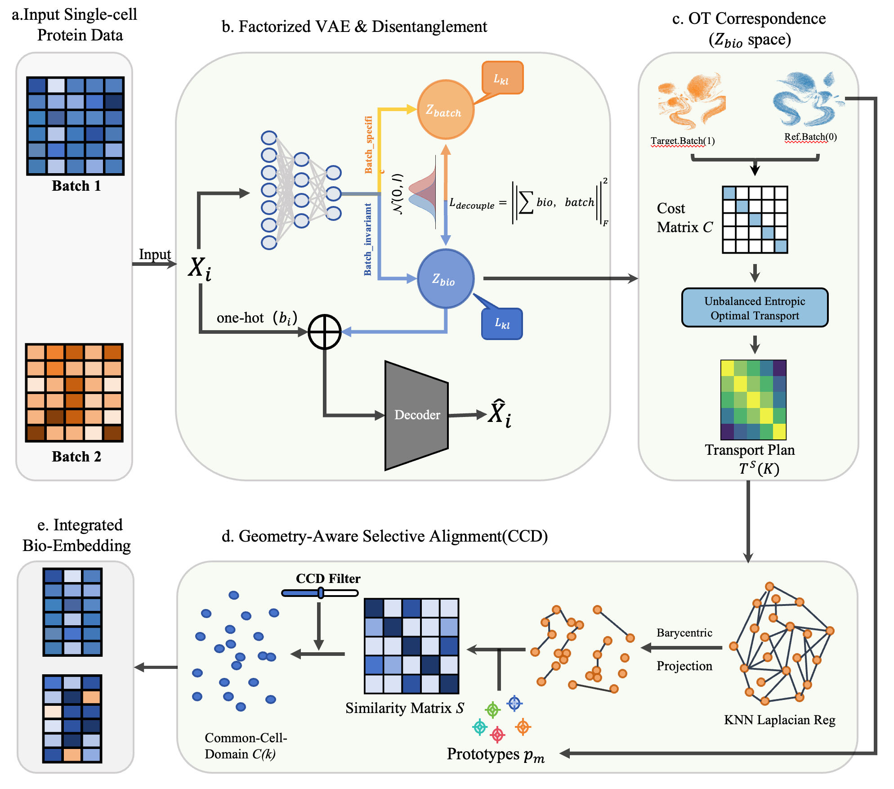

# ProSOT: A Selective Batch Integration Framework for Single-Cell Proteomics via Unbalanced Optimal Transport
## Installation
It is recommended to create a new environment for ProSOT.
```
conda create -n ProSOT python==3.8
conda activate ProSOT
``` 
The clone the ProSOT repository:
```
git clone https://github.com/VitaIntelli-CQU/ProSOT.git
```
and then install the required packages below:
```
pip install -r requirements.txt
```
## Citation

If you find our code useful, please consider citing our work:

```bibtex
@article{prosot,
  title={A Selective Batch Integration Framework for Single-Cell Proteomics via Unbalanced Optimal Transport},
  author={Jin Mao , Guo Chen , Xingming Lu , Jiangshan Xu , Nuodi Fan ,Yunqing Fu, Yuansong Zeng},
  journal={bioRxiv},
  year={2026}
}
```
